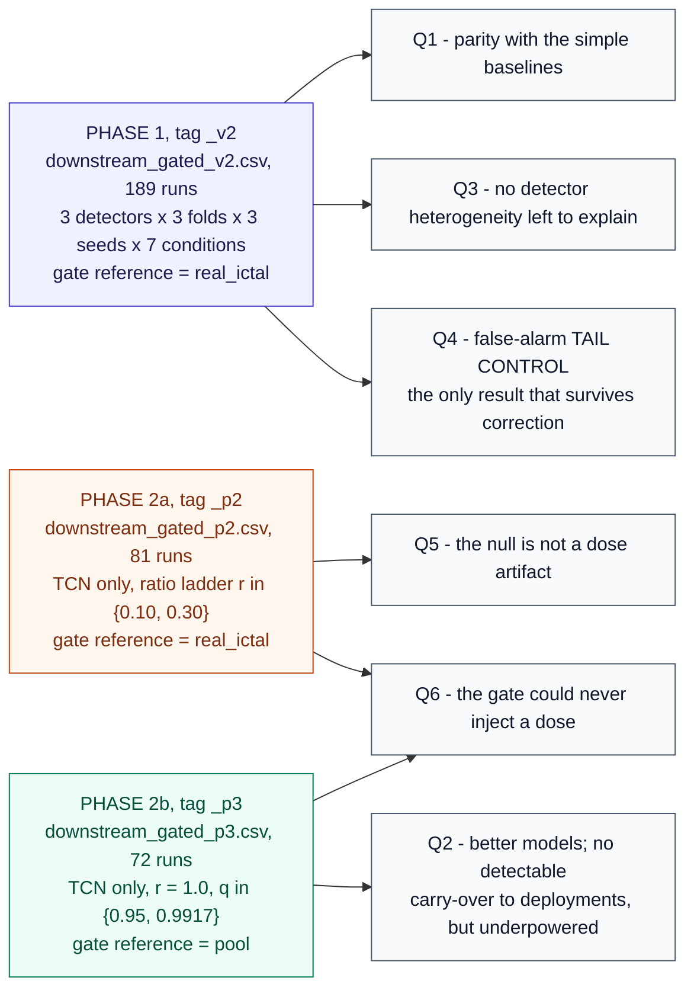
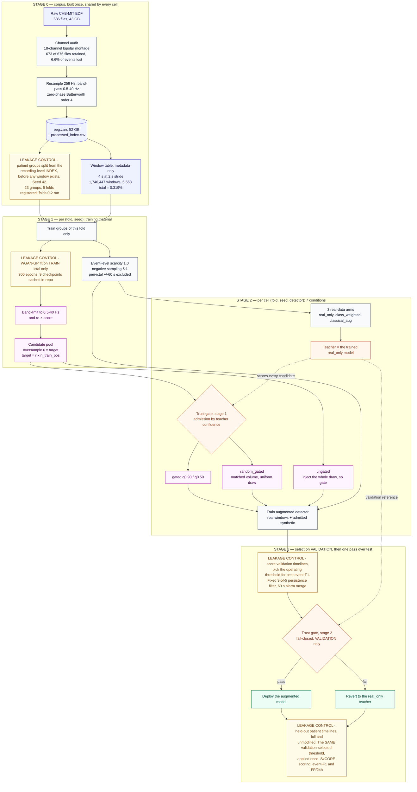
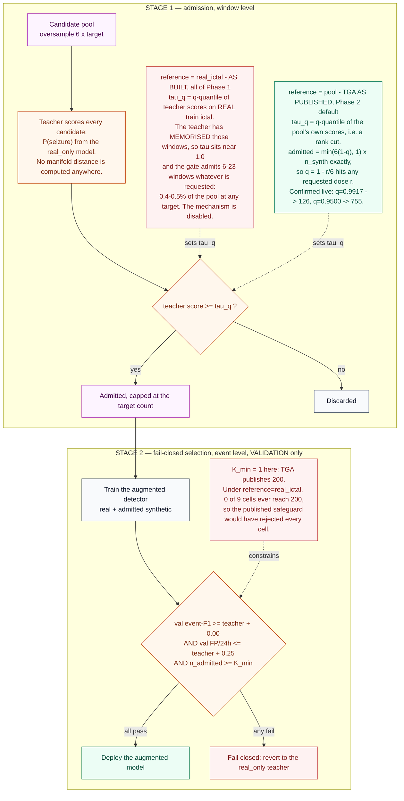

# Does synthetic ictal EEG augmentation help, harm, or neither?

A leakage-safe, pre-registered benchmark of generative augmentation and fail-closed trust
gating for **patient-independent** seizure detection on CHB-MIT, scored at the **event level**
with SzCORE conventions.

The short answer, at n = 9 paired runs per detector across three architecture families:
**synthetic ictal augmentation performs at parity with simple baselines, the gate reliably
controls the false-alarm tail, and admission quality improves models — with no detectable
carry-over to deployments, though this study is too small to call that equivalence.** Phase 2
added three things: the negative result is **not** an artifact of
injection dose; the gate as originally built **cannot inject a dose at all** (6–23 windows
whatever is requested, because the admission threshold is calibrated on data the teacher has
memorised); and with the published rank cut restored, teacher admission beats a random draw by
+0.072 event-F1 in 8 of 9 cells — which **does not survive correction for fold dependence**.
Details and caveats in [Results](#results).

**Author:** Abdullah R. Alotaibi ·
[github.com/Oxidopamine](https://github.com/Oxidopamine/chbmit-synthetic-benchmark)

> **Status.** Phases 1 and 2 complete. This repository contains the full experimental record,
> including three corrections to our own analysis: two in
> [`reports/DECISION_GATE_1.md`](reports/DECISION_GATE_1.md) (the reference is selection-biased;
> the admission null was confounded) and one in
> [`reports/DECISION_GATE_2.md`](reports/DECISION_GATE_2.md) (a plan change we recommended and
> then had to reverse). Phase 2 ran on one detector for budget reasons — see
> [Budget-constrained scope](#budget-constrained-scope).
>
> A manuscript draft is in progress at
> [`reports/PREPRINT_DRAFT.md`](reports/PREPRINT_DRAFT.md).

---

## Contents

- [Why this benchmark exists](#why-this-benchmark-exists)
- [Relationship to prior work](#relationship-to-prior-work)
- [Data and preprocessing](#data-and-preprocessing)
- [Experimental design](#experimental-design)
- [Pipeline architecture](#pipeline-architecture)
- [The trust gate](#the-trust-gate)
- [Results](#results)
- [Methodological findings](#methodological-findings)
- [Reproducing](#reproducing)
- [Repository layout](#repository-layout)
- [Limitations](#limitations)
- [Budget-constrained scope](#budget-constrained-scope)
- [Known issues](#known-issues)
- [Citation](#citation)

---

## Why this benchmark exists

Seizures are rare. In our processed CHB-MIT corpus, ictal windows are **0.319 %** of the data
(5,563 of 1,746,447). That imbalance makes generative augmentation of the positive class an
attractive idea, and a large literature reports gains from it.

Two things make most of those reports hard to act on clinically:

1. **Window-level metrics conceal event-level harm.** A model can improve balanced accuracy or
   AUROC while inflating false alarms per day — the number that determines whether a detector is
   deployable. We score every arm with `timescoring` under the SzCORE conventions
   (`toleranceStart = 30 s`, `toleranceEnd = 60 s`, `minOverlap = 0`, `maxEventDuration = 300 s`,
   `minDurationBetweenEvents = 90 s`) and report FP/24 h alongside event-F1 throughout.
2. **Patient-independent validation is rare.** Splitting windows rather than patients leaks
   subject identity and inflates every number. Here, patient groups are partitioned *before*
   windowing, generators are fit on training patients only, and provenance is enforced in code
   and tested.

The benchmark's primary object of study is therefore **harm**, pre-registered before test
scoring, with tail risk reported alongside every mean.

## Relationship to prior work

The fail-closed trust gate is **not our invention**. It is adapted from trust-gated augmentation
(TGA):

> Choi, D.; Yip, C.; Choi, A.; Park, J. (2026). *Trust-gated synthetic EEG augmentation reduces
> performance drops when generalizing to new patients.* **npj Digital Medicine 9(1), art. 634.**
> [`10.1038/s41746-026-02778-0`](https://doi.org/10.1038/s41746-026-02778-0) · PMID 42185473

Our contributions are the **seizure-specific, event-level reformulation** of the admission and
fail-closed criteria, the **harm characterisation** under a pre-registered definition, and the
**matched-volume random-gating control** that the source study ran and reported as mixed. Phase 2
resolves that control at a real dose: teacher admission produces better models, with no
detectable advantage after the fail-closed stage — though the study bounds equivalence only at
±0.121 event-F1, so this is a failure to detect rather than a demonstration of equivalence
(see [Q2](#q2--does-admission-quality-matter)).

Implementation fidelity against the published method is documented below. **Two divergences
turned out to matter more than we understood when we listed them**, and both are now quantified:

- **Admission reference.** TGA cuts by rank on the candidate pool; we thresholded on a quantile
  of real ictal windows. Because the teacher has memorised those windows, the threshold sits near
  1.0 and the gate admits **6–23 windows whatever is requested** — the divergence did not shift
  the operating point, it disabled the mechanism. Restoring the rank cut gives exact dose control
  and is what made Q2 answerable.
- **Minimum acceptance.** TGA uses `K_min = 200`; we used 1. Under the real-ictal reference,
  **0 of 9 cells** ever reach 200 admitted windows, so the published safeguard would have
  rejected every cell of Phase 1.

Both are in [Known issues](#known-issues) and [`reports/DECISION_GATE_2.md`](reports/DECISION_GATE_2.md) Q6.

## Data and preprocessing

[CHB-MIT Scalp EEG](https://physionet.org/content/chbmit/1.0.0/) (PhysioNet), retrieved from the
AWS Open Data mirror.

| property | value |
|---|---|
| patients / groups | 24 / **23** (chb21 is chb01 re-recorded and is grouped with it) |
| recordings | 686 EDF files, 676 in manifest, **673 retained** after channel audit |
| duration | 3,505,100 s = **973.6 h** |
| seizure events | **198** annotated; 185 survive windowing |
| montage | **18 bipolar channels**, common to all retained files |
| sampling rate | 256 Hz |
| band-pass | 0.5–40 Hz, zero-phase Butterworth (order 4) |
| windows | 4 s, 2 s stride → **1,746,447** windows, **5,563 ictal (0.319 %)** |
| normalisation | per-window, per-channel z-score |

Files whose montage cannot supply the 18-channel set are dropped by an explicit audit
(`chbmit/channel_audit.py`), which also reports the fraction of seizure events lost — 6.6 % here.
Peri-ictal background within 60 s of a seizure is excluded from training negatives to avoid
ambiguous labels.

## Experimental design

Pre-registered in [`PREREGISTRATION.md`](PREREGISTRATION.md), with machine-readable constants in
[`configs/chbmit_synthetic.yaml`](configs/chbmit_synthetic.yaml). **Harm** is fixed before test
scoring as a paired delta with `Δevent-F1 < −0.01` **OR** `ΔFP/24h > +0.25`, reported with harm
rate, worst-cell delta, and CVaR at α = 0.10.

**Grid.** 3 detectors × 3 folds × 3 seeds × 7 conditions = **189 runs** (n = 9 paired cells per
detector per condition).

**Detectors** — three families, deliberately spanning two orders of magnitude in capacity so that
a benefit seen in one can be attributed to capacity or to architecture:

| detector | family | parameters |
|---|---|---|
| EEGNet | compact depthwise-separable CNN | **1,905** |
| LCT | conv stem + transformer encoder | **120,834** |
| TCN | dilated causal convolutions | **129,441** |

**Conditions:**

| condition | role |
|---|---|
| `real_only` | baseline; also the gate's teacher |
| `class_weighted` | registered simple baseline (focal loss with positive weighting) |
| `classical_aug` | registered simple baseline (signal-space augmentation) |
| `ungated` | all synthetic injected, no gate |
| `gated q=0.90` | pre-registered core trust gate |
| `gated q=0.50` | admission sweep point |
| `random_gated q=0.90` | **matched-volume control** — same count, uniform random selection |

**Splits.** Patient groups partitioned before windowing; test groups are perfectly disjoint across
folds. Folds 0–2 were run (train/val/test groups: 14/5/4, 13/6/4, 14/4/5).

**Generator.** WGAN-GP fit per (fold, seed) on that fold's training ictal windows only, with
outputs band-limited to the acquisition passband before injection. Nine checkpoints are cached in
the repository, so the grid reproduces without retraining a generator.

**Which grid answers which question.** Phase 1 ran the full 189-run grid across all three
detectors; Phase 2 ran two narrower TCN-only grids, for the reasons in
[Budget-constrained scope](#budget-constrained-scope). The `n` behind any number below depends on
which grid produced it:



Every cell of every grid is one `(fold, seed, detector)` block, so **n = 9 paired cells** backs
each comparison — three folds × three seeds — per detector in Phase 1, and for TCN in Phase 2.

## Pipeline architecture

Four stages. **Stage 0 is built once** and shared by every run in the grid; stages 1–3 are
re-derived per **cell**, where a cell is one `(fold, seed, detector)` block. Yellow nodes are the
leakage controls.



Leakage controls, in the order they apply — each enforced in code and covered by tests:

- patient groups are split **before** windowing, from the recording-level index, never by
  partitioning a window table (`chbmit/splits.py`);
- generators are fit **only** on the training patients of their fold, and their output is
  band-limited to the acquisition passband before injection;
- synthetic windows are training-only and carry per-window provenance;
- the operating threshold is selected on **validation** and applied unchanged to test, together
  with a fixed 3-of-5 persistence filter and a 60 s alarm merge;
- the fail-closed decision reads **validation** event-F1 and FP/24 h only — it never sees test;
- validation and test always run on full, unmodified real timelines.

## The trust gate

Two stages, both event-level reformulations of the published method. Stage 1 decides *which*
synthetic windows are injected; stage 2 decides whether the resulting model is deployed at all.
The red node in stage 1 is the divergence that disabled the mechanism for all of Phase 1; the
green node is the published rule, restored in Phase 2.



**Admission is badly conditioned as built.** Because the threshold is a quantile of the teacher's
scores on *real* ictal windows, and the teacher saturates there, moving `q` from 0.50 to 0.90
shifts the threshold by 0.037 while changing admission **174×**. At q = 0.99 nothing is admitted
at all. The published method instead takes a rank cut on the candidate pool, which is
well-conditioned; `TrustGateConfig.reference = "pool"` implements that, is exposed as
`--gate-reference pool`, and is the Phase 2 default. The option existed from the start but the
driver never set it, so it was present and unreachable until Phase 2 — see
[Q6](#q6--why-did-the-gate-never-inject-anything).

Observed admission across the 27 gated q = 0.90 cells of Phase 1: **median 80 windows**
(range 0–580), against a target of ~2,508. Revert rate **0.81**. At q = 0.50, 63 % revert and the
median admitted count is exactly **2,508** — the requested quota — meaning the threshold never
binds and that arm is really a top-1/6 rank cut, not a confidence threshold.

## Results

All figures are n = 9 paired (fold, seed) cells per detector, event-F1 on held-out patients.

### Arm means

| detector | `real_only` | `class_weighted` | `classical_aug` | `ungated` | `gated q0.90` | `random_gated` |
|---|---|---|---|---|---|---|
| EEGNet | 0.225 | 0.205 | 0.197 | 0.234 | 0.218 | 0.224 |
| LCT | 0.312 | 0.299 | 0.298 | 0.317 | 0.318 | 0.327 |
| TCN | 0.293 | **0.364** | 0.225 | 0.268 | 0.301 | 0.305 |

### Q1 — Does synthetic augmentation beat simple baselines?

**No, and it does not lose either — it is at parity.** Δevent-F1 for `gated q0.90` against each
baseline (cells better, of 9):

| detector | vs `real_only` | vs `class_weighted` | vs `classical_aug` |
|---|---|---|---|
| EEGNet | −0.007 (1/9) | +0.013 (5/9) | +0.021 (6/9) |
| LCT | +0.006 (1/9) | +0.019 (4/9) | +0.020 (5/9) |
| TCN | +0.008 (1/9) | **−0.063 (2/9)** | +0.076 (6/9) |

The largest single apparent loss is **TCN against `class_weighted`**, where a focal loss with a
positive-class weight — two lines, no generator — reaches 0.364 event-F1 at 9.8 FP/24 h versus
`real_only`'s 0.293 at 16.9, better on both axes. For a rare-event problem this is the expected
place for reweighting to win.

**−0.063 is not a measurement — withdrawn 2026-08-31.** The floor it was "within plausible reach
of" has since been measured. Phase 2 re-ran all three simple baselines for TCN under identical
settings with the initialisation fix in place (Known issue #1), and they moved by
σ = 0.099–0.171 event-F1:

| baseline (TCN, 9 cells) | Phase 1 | Phase 2 re-run | σ of paired difference |
|---|---|---|---|
| `real_only` | 0.293 | 0.283 | 0.099 |
| `class_weighted` | **0.364** | **0.271** | **0.159** |
| `classical_aug` | 0.225 | 0.255 | 0.171 |
| `ungated` (draws a pool, so was seeded incidentally) | 0.268 | 0.268 | 0.000 — identical 9/9 |

Against the re-run baselines the same gated arm reads **+0.030 (3/9)** instead of −0.063 (2/9),
and −0.059 instead of −0.128 against the best-of-3 reference. Nothing is significant either way,
so **Q1's answer — parity — is unchanged**; what changes is that the magnitude cannot be quoted.
Two draws of the identical baseline differ by 0.093, which brackets the 0.063. EEGNet and LCT
baselines have not been re-run, so their rows above carry the same caveat.

### Q2 — Does admission quality matter?

**Resolved in Phase 2: better models; no detectable difference after the fail-closed stage.**
With the published pool rank cut
restored, teacher admission at a real dose (755 windows) produces clearly better augmented models
than a random draw of the same size — **+0.072 event-F1 in 8 of 9 cells** — and gets them past
validation three times as often (2/9 reverts vs 6/9). After the fail-closed stage, the deployed
policies separate by only −0.007:

| arm | pre-revert event-F1 | deployed event-F1 | reverted |
|---|---|---|---|
| gated q = 0.95 | **0.277** | 0.300 | 2/9 |
| random q = 0.95 | **0.205** | 0.307 | 6/9 |

We cannot detect a difference after the fail-closed stage — but the equivalence bound this study
supports is ±0.121 event-F1 (TOST), *wider than the +0.072 effect above*, so this is underpowered
rather than a demonstration that the fallback erases the gain. The proposed mechanism — reverting
random's failures to `real_only` recovers most of what curation buys — is a **hypothesis**,
supported by the revert counts and the fallback result but not established here.

The +0.072 itself **does not survive correction**: Wilcoxon 0.020, but Nadeau–Bengio **0.140**,
fold-level 0.103, and Bonferroni for the family requires p < 0.0063. That is the same collapse,
at the same magnitude, as the retired `+0.083` headline (Wilcoxon 0.008 → NB 0.135). Direction
and count are reportable; significance is not. Full detail in
[`reports/DECISION_GATE_2.md`](reports/DECISION_GATE_2.md).

<details>
<summary>Why the Phase 1 answer to this question was withdrawn</summary>

The Phase 1 control was built correctly — `random_gated` drew exactly as many windows as
`gated q0.90` from the same pool, verified equal in 27 of 27 cells — but the comparison as
originally scored was not informative, for three reasons
([`reports/DECISION_GATE_1.md`](reports/DECISION_GATE_1.md), CORRECTION 2):

1. It was scored **after the fail-closed revert**, and in 18 of 27 cells both arms reverted to
   the same `real_only` model — bit-identical by construction. On the augmented models the
   detector gaps are 0.023 / 0.024 / 0.016, i.e. **2.6–4.1× larger** than the 0.006 / 0.009 /
   0.004 first reported, with a per-cell mean \|difference\| of 0.059 event-F1.
2. It was tested **only on event-F1** — the axis Q4 shows the gate does *not* act on. On FP/24h
   the two selections differ by +5.0 (EEGNet), −16.3 (LCT) and −9.9 (TCN), mean \|Δ\| 16.2.
   Sign-inconsistent, so no win for admission — but not "nothing".
3. It was run **only at q = 0.90**, where the gate admits 0.3–13% of the intended dose (median 8
   windows of ~2508 for EEGNet). At q = 0.50 the gate admits the full dose and there is no
   control at all.

What the Phase 1 grid supports: **at q = 0.90 the admission stage is inert because it admits
almost nothing** — a fact about threshold calibration, not about whether admission quality can
matter. Phase 2 confirmed that diagnosis and fixed it (see Q6 below).

</details>

### Q5 — Was the negative result an artifact of injection dose?

**No.** Phase 1 sampled only r ≈ 0.032 and r = 1.00, leaving r ∈ [0.05, 0.30] — the band the
parent method's validation ladder actually selects from — unsampled. Since the dose–performance
curve is theoretically U-shaped, that was a real confound. Filling it:

| arm | event-F1 | Δ vs `real_only` | cells better |
|---|---|---|---|
| `real_only` (r = 0) | 0.283 | — | — |
| ungated r = 0.10 | 0.264 | −0.019 | 5/9 |
| ungated r = 0.30 | 0.217 | −0.065 | 4/9 |
| ungated r = 1.00 | 0.268 | −0.015 | 5/9 |

Monotone through the parent's band, **no interior peak**, nothing significant. The Phase 1
conclusion stands on better ground than before.

### Q6 — Why did the gate never inject anything?

**Because the admission threshold is calibrated on data the teacher has memorised.** Under
`reference="real_ictal"` the gate admits **6 windows against a target of 251, and 23 against 752**
— an admission rate of 0.4–0.5 % of the pool *regardless of target*, so no ratio ladder can move
it. TGA publishes a pool rank cut; this benchmark substituted a real-ictal quantile, and the
substitution did not merely shift the operating point — it disabled the mechanism.

With `reference="pool"` restored, admitted = `min(oversample·(1−q), 1) · n_synth` **exactly**, so
q becomes direct dose control. Confirmed live: q = 0.9917 → 126 admitted (predicted 125),
q = 0.9500 → 755 (predicted 752).

Compounding it: TGA publishes `K_min = 200`; this benchmark used 1. **0 of 9 cells** reach 200
admitted windows under the real-ictal reference — the published safeguard would have admitted
nothing, in every cell.

### Q3 — Capacity or architecture?

**Neither: there is no heterogeneity left to explain.** All three families behave alike. An
earlier iteration of this benchmark reported "TCN benefits, EEGNet is neutral"; that contrast does
not survive the addition of the registered baselines and the third detector family.

### Q4 — What does the gate actually control?

**The false-alarm tail, decisively.** Pooling all 81 gated-family cells and splitting by the
gate's own admit/revert decision (Δ against `real_only`, augmented model):

| | n | mean ΔFP/24h | median | worst | mean Δevent-F1 |
|---|---|---|---|---|---|
| **admitted** | 21 | **−22.58** | −26.34 | **+15.28** | +0.031 |
| **reverted** | 60 | **+10.90** | +13.83 | **+62.63** | −0.025 |

- ΔFP/24 h separation: Mann–Whitney **p < 0.0001**; within-fold permutation (20,000 draws)
  **p < 0.0001**, both two-sided
- Tail event ΔFP/24 h > +20: **0 of 21 admitted vs 23 of 60 reverted**, Fisher exact
  **p = 0.0004**
- Δevent-F1 separation: **p = 0.092** — weak

The asymmetry is the finding. **The gate is a false-alarm tail controller, not an event-F1
selector**, and this is the only result in the grid that survives correction for the 54
comparisons reported.

**It is not selection on the outcome.** The gate admits partly on *validation* FP/24 h, so
admitted cells might be expected to show better *test* FP/24 h for trivial reasons. They do not
need to: only 19 of the 60 reverts fired on the FP criterion, while **39 fired on validation
event-F1**. Dropping every cell selected on validation FP and re-testing on the remainder — cells
rejected on a **different metric** — the separation gets *stronger*:

| | n | mean ΔFP\24 h | tail > +20 |
|---|---|---|---|
| admitted | 21 | **−22.58** | **0 / 21** |
| reverted on validation event-F1 | 41 | +10.45 | 16 / 41 |

Mann–Whitney **p = 0.000046**, within-fold permutation **p < 0.0001**, Fisher **p = 0.000494** —
all clearing Bonferroni. The gate's event-F1 criterion **predicts test false-alarm inflation**, a
cross-metric, cross-split prediction that selection-on-the-outcome cannot produce.

**It is not a dose effect either.** Phase 2 showed the gate admits anywhere from 6 to 2,508
windows, raising the possibility that admitted cells were simply the low-dose ones. They are not:
dose does not differ between the groups (median 577 admitted vs 136 reverted, p = 0.197, sign
*opposite* to the confound), dose does not predict ΔFP/24 h at all (Spearman **−0.010**,
p = 0.932), and the separation holds **within** each arm — `gated q0.5` p = 0.0008 and
`random_gated q0.9` p = 0.0008, both clearing Bonferroni alone. The separation is a property of
the fail-closed decision, not of how much synthetic was injected.

### Statistics

We report the Wilcoxon signed-rank test that is conventional in this literature **and** the
corrections it requires, because the nine cells per detector are not independent — three seeds
share each split.

| correction | effect |
|---|---|
| Nadeau–Bengio (variance scaled by `1/n + n_test/n_train`, ratio 0.317) | **no comparison reaches p < 0.05**; minimum p = 0.054 where Wilcoxon reports 0.016 |
| fold-level t-test (seeds averaged, disjoint test groups) | consistent with the above |
| Bonferroni over the 54 reported comparisons | threshold p < 0.0009; **only the tail result clears it** |

Defensible claims from this grid are therefore **direction and count**, not significance — with
the single exception of the tail-control result.

## Methodological findings

Three results about *measurement* emerged that are independent of the augmentation question, and
in our view are the most transferable part of this work.

### Reference selection is not neutral

The pre-registration names the harm reference as "the best simple baseline per (fold, seed)".
That is a **selected maximum**, and our first analysis compounded the problem by selecting it on
*test* performance. The result is an inflated reference:

| detector | real_only | class_weighted | classical_aug | **best-of-3** |
|---|---|---|---|---|
| EEGNet | 0.225 | 0.205 | 0.197 | **0.298** |
| LCT | 0.312 | 0.299 | 0.298 | **0.413** |
| TCN | 0.293 | 0.364 | 0.225 | **0.428** |

For EEGNet and LCT the best-of-3 reference exceeds **every individual baseline by 0.07–0.10** —
no baseline is that good; the gap is the maximum of three noisy estimates. Q1's re-run above puts a
number on how noisy: σ = 0.099–0.171 per baseline, which is most of that gap. Against that reference
the same gated arm reads −0.080 to −0.128 with 0 of 9 cells better, which is how we first
reported it. Against any single pre-specified baseline it is at parity.

**Baseline choice moved the apparent effect by ±0.13 event-F1, against a true effect of
0.01–0.06.** The correction is recorded in full at the end of
[`reports/DECISION_GATE_1.md`](reports/DECISION_GATE_1.md) rather than silently applied; the
original claim and its refutation both stand in the record.

### Results are sensitive to execution environment, not only to seed

Two measured instances:

- **DataLoader workers change results.** Raising `--num-workers` from 0 to 8 is 2.16× faster and
  changes **6 of 7 conditions** on an otherwise byte-identical cell (`real_only` 0.0938 → 0.1605;
  `gate_n_admitted` 198 → 436). PyTorch draws a base seed from the global RNG to seed workers,
  perturbing the stream that also drives dropout and the shuffle permutation. All results here use
  `num_workers = 0`.
- **Hardware and library versions change results.** The same cell scored 0.310 on one GPU and
  0.245 on another, with byte-identical splits and matching training-table sizes. No
  deterministic-algorithm flags are set.

Consequently, **all comparisons in this repository are within-run**, and cross-run per-cell
comparison is explicitly unsupported.

### A fail-closed gate must fall back to the best available model

`_apply_fail_closed` reverts to the `real_only` teacher, while the pre-registration defines harm
against the best simple baseline. Where a baseline beats `real_only`, every revert discards that
gap — the gate fails *open* with respect to its own registered criterion. Re-scoring the
**same admission decisions** with a best-baseline fallback (no retraining; reverting is a
deterministic choice among already-computed arms):

| detector | as built | best-baseline fallback | harm rate |
|---|---|---|---|
| EEGNet | −0.080 | **−0.016** | 0.44 → **0.11** |
| LCT | −0.095 | **−0.037** | 0.67 → **0.22** |
| TCN | −0.128 | **−0.007** | 0.78 → **0.11** |

*(Deltas against the best-of-3 reference; see the caveat above. The relative improvement is the
point.)*

### The generator is not the explanation

Before accepting a null we audited what was being injected. Against the fold-0 checkpoint:

| check | result | verdict |
|---|---|---|
| mode collapse (mean pairwise distance ÷ real) | **0.911** | diverse; a cVAE variant scored 0.001 |
| memorisation (synth→real NN ÷ real→real NN) | **1.156** | not copying training data |
| normalised space | mean 0.0000, std 1.0000 | correct |
| out-of-band power > 40 Hz | 0.0093 → **0.0005** after band-limiting | as designed |
| in-band spectrum (δ→γ, ratio to real) | 0.76 – 1.32 | reasonable |
| cross-channel mean \|corr\| | 0.205 vs real 0.263 | **under-coupled** |
| amplitude extremes | \|max\| 7.6 vs real 15.5 | **tails missing** |

The last two are genuine fidelity limitations and are reported as such. They are not defects, and
the synthetic data is diverse, novel and correctly scaled — so the parity result is a statement
about augmentation, not about a broken generator. Reproduce with
`python3 scripts/diag_generator_health.py 0 42`.

## Reproducing

### Requirements

```bash
pip install -r requirements.txt
```

Core: `numpy<2.0`, `scipy`, `pandas`, `zarr<3.0`, `torch>=2.1`, `scikit-learn`, `mne`, `pyedflib`,
`timescoring`.

### 1. Build the dataset

```bash
aws s3 sync --no-sign-request s3://physionet-open/chbmit/1.0.0/ data/raw_chbmit/
python3 scripts/run_preprocess.py
```

~43 GB download, ~54 min single-threaded preprocessing, producing a 52 GB Zarr store.
Splitting is seeded at 42; verify determinism before trusting cached generator checkpoints:

```bash
git diff --stat -- results_chbmit_synthetic/real_validation/splits/splits_seed42.json   # must be empty
```

### 2. Run the grid

Each of the three grids in the record is one command. Phase 1 — 189 runs, all three detectors,
under the admission reference the grid actually used (reproduced as run, not as it should have
been run):

```bash
python3 scripts/run_multiseed_downstream.py \
  --folds 0 1 2 --seeds 42 123 2024 --detectors eegnet lct tcn \
  --qs 0.90 0.50 --tag _v2
```

Phase 2a — the ratio ladder that answers Q5 and exposes Q6 (81 runs, TCN only):

```bash
python3 scripts/run_multiseed_downstream.py \
  --folds 0 1 2 --seeds 42 123 2024 --detectors tcn \
  --ratios 0.10 0.30 --qs 0.90 --tag _p2
```

Phase 2b — the published pool rank cut, which is what makes `q` a real dose control and Q2
answerable (72 runs, TCN only). `--gate-reference` defaults to `real_ictal` for backward
compatibility with the record; **pass `pool` for any new work**:

```bash
python3 scripts/run_multiseed_downstream.py \
  --folds 0 1 2 --seeds 42 123 2024 --detectors tcn \
  --gate-reference pool --qs 0.95 0.9917 --tag _p3
```

All three grids are resumable — completed `(fold, seed, detector)` blocks are skipped via the
output CSV. The nine WGAN checkpoints are cached in the repository, so no generator training
occurs. **Do not raise `--num-workers`**; see
[above](#results-are-sensitive-to-execution-environment-not-only-to-seed).

Reference runtime for Phase 1: 13.1 h wall-clock on three NVIDIA A100 workers, one per detector
(≈ 1.2–1.9 h per block). Phase 2's two grids together took ~11 h across six A100 Spot jobs. The
workload is dominated by single-threaded per-window normalisation on the CPU, not by GPU compute,
so a smaller accelerator performs comparably.

### 3. Analyse

```bash
python3 scripts/analyze_multiseed.py --tag _v2                                 # Phase 1
python3 scripts/analyze_multiseed.py --tag _p2 --conds-expected 9 --ratio 0.10  # Phase 2a
python3 scripts/analyze_multiseed.py --tag _p3 --conds-expected 8               # Phase 2b
```

Emits the paired-delta summary, the safety–benefit frontier and the admitted-vs-reverted tail
analysis, with Nadeau–Bengio and fold-level tests alongside Wilcoxon and an explicit comparison
count. `--conds-expected` must match the grid's condition count, or partial blocks are treated as
complete. Legacy 4-condition CSVs are readable with `--conds-expected 4`.

### Cloud execution

`scripts/vertex_*.sh` run the grid as one Vertex AI custom job per detector on Spot instances,
staging code and data from GCS and syncing partial results back so preemption costs at most one
block.

## Repository layout

```
chbmit/          corpus handling — manifest, channel audit, preprocessing, windowing,
                 patient-group splits, scarcity subsampling, dataset/normalisation
models/          detectors — EEGNet, LCT, TCN (registry in __init__.py)
synthetic/       generators (cVAE, WGAN-GP), band-limiting, trust gate, quality checks
augmentation/    non-generative baselines — class weighting, classical augmentation,
                 balanced sampling
evaluation/      SzCORE event scoring, window metrics incl. Brier/ECE, threshold selection,
                 patient-level aggregation, paired statistics and tail risk
experiments/     cell runner and training loop, grid drivers, aggregation
scripts/         entry points — preprocessing, the multi-seed grid, analysis, diagnostics
reports/         DECISION_GATE_1.md (Phase 1 results and correction), DECISION_GATE_2.md
                 (Phase 2 results), PREPRINT_DRAFT.md, related work and literature audit
tests/           leakage, scoring, split and gate invariants
```

Key documents:

| file | contents |
|---|---|
| [`PREREGISTRATION.md`](PREREGISTRATION.md) | analysis decisions fixed before test scoring |
| [`reports/DECISION_GATE_1.md`](reports/DECISION_GATE_1.md) | Phase 1 results **and the correction to them** |
| [`reports/DECISION_GATE_2.md`](reports/DECISION_GATE_2.md) | Phase 2 results — Q5, Q6 and the reopened Q2 |
| [`reports/PREPRINT_DRAFT.md`](reports/PREPRINT_DRAFT.md) | manuscript draft (v0.4; all sections drafted, bibliographic details pending) |

## Limitations

Stated plainly, because several of them bound the conclusions:

1. **Single dataset.** CHB-MIT only. It is pediatric and 2.2× denser in seizures than the
   Dianalund corpus used by the SzCORE challenge, which raises FP/24 h at fixed precision. Siena
   is specified but not run.
2. **Underpowered.** n = 9 per detector, from 3 folds × 3 seeds. No comparison except the
   tail-control result survives correction for fold dependence or multiplicity.
3. **Three folds of five.** The registered design is 5 folds; folds 3–4 were not run.
4. **Validation panel is narrow.** Only 8 of 23 patient groups ever serve as validation, and five
   of them appear in 4 of 5 folds. Both the admission threshold and the fail-closed decision live
   entirely on validation, so the gate has effectively been evaluated on one near-fixed panel.
5. **Scarcity fixed at 1.0.** The registered grid includes 0.5 and 0.25, where augmentation has
   most to offer. Not run.
6. **Every Phase 1 number was produced under a broken admission reference.** The real-ictal
   quantile makes `q` a poorly-conditioned control, puts `q = 0.99` out of reach, and holds
   admission to 6–23 windows whatever is requested. Phase 2 restored the published pool rank cut
   (`--gate-reference pool`), but only for the TCN `_p3` grid — Phase 1's three-detector grid was
   not re-run, and re-running it is the largest outstanding cost in the project.
7. **Generators are unconditional.** The cVAE's class embedding is constant and
   `wgan_gp_provider.generate()` accepts a `class_label` it never uses. Only the ictal phase is
   generated, which is the convention in this literature but forecloses the label-consistency half
   of the published admission rule.
8. **Pre-registration deviations** are declared in [`reports/PREPRINT_DRAFT.md`](reports/PREPRINT_DRAFT.md) §7.
9. **Dose coverage is bimodal, and the fix is budget-limited.** Realized injection
   `r = n_admitted / n_train_pos` takes only two values in this grid: `gated q0.90` at
   **r ≈ 0.032** and `ungated` / `gated q0.50` at **r = 1.00**. Nothing samples
   **r ∈ [0.05, 0.30]** — the band the parent method's validation ladder actually selects from,
   whose ceiling is 0.30. Since the dose–performance curve is theoretically U-shaped, the
   negative result against the simple baselines rests on a single point 3.3× above the source
   method's explored range.

   The registered fix is a ratio ladder crossed with `{teacher, random}` selection over all three
   detectors — 486 runs, ~34 GPU-hours, **$250–400**. **That is beyond this project's budget.**
   The planned replacement is deliberately smaller: **one detector (TCN), two or three rungs**,
   ~81–108 runs at **$25–45**, with 3 folds × 3 seeds retained so paired power at each rung is
   not sacrificed. See [Budget-constrained scope](#budget-constrained-scope).

## Budget-constrained scope

This is an unfunded project. Several design choices below were made for **cost**, not because
the science preferred them, and they are recorded here so readers can discount accordingly
rather than infer that the smaller design was the intended one.

| what the design calls for | what is affordable | why the reduction is survivable |
|---|---|---|
| Ratio ladder × `{teacher, random}` × 3 detectors — 486 runs, ~34 GPU-h, **$250–400** | **1 detector (TCN), 2–3 rungs** — 81–108 runs, ~17–22 GPU-h, **$25–45** | Phase 1's Q3 found all three detector families behave *identically*, so detector heterogeneity is not a live question. The cross-detector replication of the dose curve is genuinely lost |
| 5 folds | 3 folds | Registered design is 5; folds 3–4 unrun |
| Scarcity ∈ {1.0, 0.5, 0.25} | 1.0 only | The scarce regimes are where augmentation has most to offer, so this omission is conservative against our own negative result |
| Second dataset (Siena) | not run | Now a comparability requirement, not reach |

Two deliberate consequences:

1. **3 folds × 3 seeds is retained in every reduced design.** Paired power at each grid point is
   the one thing not traded away — underpowered comparisons are the failure mode this project has
   already corrected twice (see `reports/DECISION_GATE_1.md`, CORRECTION 1 and 2). Cutting seeds
   would be cheaper than cutting detectors and is explicitly rejected.
2. **[`scripts/gen_w2_dose_prediction.py`](scripts/gen_w2_dose_prediction.py) exists because of
   this constraint.** It predicts the per-fold dose optimum from W₂(real, synthetic) on **CPU**,
   off generator checkpoints already in the repository, so the ladder can be *aimed* at two or
   three rungs rather than swept across five. Roughly $0.30 of compute replacing ~$150 of grid.

None of this changes a reported result. It changes what can be claimed next, and the honest
statement is that the constraint is financial.

## Known issues

Five defects found by audit after each phase was scored. **All five are now fixed in code**; #1
and #2 still describe the Phase 1 *results*, which were produced before their fixes and have only
partly been re-run.

1. **Detector weight initialisation was unseeded in Phase 1** — **fixed in code**
   (`experiments/training.py:343`, commit `c32705e`, in force from Phase 2 onward). `build_model`
   used to run before any `torch.manual_seed`, the only seeding being inside `train_model`, after
   construction.

   The 2026-08-31 audit narrowed the mechanism. `WGANGPProvider.generate`
   (`synthetic/wgan_gp_provider.py:162`) calls `torch.manual_seed(seed)` and then samples **on the
   GPU**, which leaves the *CPU* generator — the one `build_model` draws from — sitting at
   exactly `manual_seed(spec.seed)`. So arms that draw a synthetic pool
   (`ungated`/`gated`/`random_gated`) were **already correctly seeded by accident**, and the fix is
   a bit-exact no-op for them: `ungated` is identical in 9/9 cells between the Phase 1 and Phase 2
   grids. Only the three pool-free arms (`real_only`, `class_weighted`, `classical_aug`) were
   exposed, and those Phase 1 rows are **not reproducible**.

   Consequences, now measured rather than asserted: within-family comparisons were always
   init-controlled; cross-family comparisons in Phase 1 were not, and the run-to-run floor for the
   affected arms is **σ = 0.099–0.171 event-F1** (see [Q1](#q1--does-synthetic-augmentation-beat-simple-baselines)).
   TCN's −0.063 against `class_weighted` is withdrawn on that basis. The tail-control result (Q4)
   is unaffected in kind — it compares a model's own validation decision against its own test FP,
   and a noisier reference makes the test conservative, not liberal. Phase 2 re-ran the three
   baselines for TCN; **EEGNet and LCT (54 cells) have not been re-run.**
2. **The admission threshold was calibrated on the teacher's own training positives**
   (`experiments/training.py:326`–`334`), which the teacher has memorised, so the reference
   distribution is pinned near 1.0. This is the mechanism behind the ill-conditioning described in
   [The trust gate](#the-trust-gate), and it means the gate as run cannot distinguish a
   low-fidelity generator from a degenerate reference. **Fixed as a default 2026-08-31:**
   `TrustGateConfig.reference` and `run_multiseed_downstream.py --gate-reference` now both default
   to `"pool"`, the published rank cut. Pass `--gate-reference real_ictal` to reproduce Phases 1–2.
   A regression test (`tests/test_trust_gate.py`) pins both behaviours.
3. **RESOLVED IN PHASE 2 — kept for the record.** The matched-volume admission control was scored
   and dosed in ways that could not detect an effect. It was paired on the *post-revert* `event_f1`, so the 18 of 27 cells where both arms
   failed closed to the same `real_only` model are identical by construction; it was tested only
   on event-F1, the axis the gate demonstrably does not act on; and it was run only at q = 0.90,
   where defect 2 above holds the injected dose to 0.3–13 % of the intended volume. The control
   itself is correctly built — same pool, same count in 27 of 27 cells, init-matched — so this is
   a defect in the analysis and the grid point, not in the code. Full working in
   [`reports/DECISION_GATE_1.md`](reports/DECISION_GATE_1.md) CORRECTION 2. **Phase 2 fixed it**
   — pool-relative admission gives the gated arm a real dose, and Q2 is answered in
   [`reports/DECISION_GATE_2.md`](reports/DECISION_GATE_2.md).
4. **The admission reference diverges from the published method, and this disables the gate.**
   `reference="real_ictal"` thresholds on the teacher's own memorised training positives, so the
   gate admits 6–23 windows whatever is requested. Every Phase 1 result, and the Phase 2 ratio
   ladder, ran under this reference. Only the final `_p3` grid uses the published pool rank cut.
   `TrustGateConfig.reference` existed from the start but the driver never set it — the option was
   present and unreachable until `--gate-reference` was added, and it remained the *default* until
   2026-08-31, so until then a fresh clone reproduced the disabled mechanism. See #2.

5. **`analyze_multiseed.py --ratio` returned an all-NaN report** — **fixed 2026-08-31.** The rung
   filter was applied to every condition, but the three simple baselines carry `ratio = NaN`, so
   selecting a rung dropped them, emptied the registered reference and NaN'd the whole report. Both
   commands printed in `DECISION_GATE_2.md` were affected. The numbers in that report are correct
   (independently re-derived) but did not come from the command as printed. Each rung now writes to
   its own `analysis_*_r*` outputs instead of overwriting the other's.

Full analysis, including which Phase 1 claims survive and which do not, is in
[`reports/DECISION_GATE_1.md`](reports/DECISION_GATE_1.md).

## Citation

If you use this benchmark, please cite it:

```bibtex
@software{alotaibi2026chbmitbench,
  author  = {Alotaibi, Abdullah R.},
  title   = {Does synthetic ictal {EEG} augmentation help, harm, or neither?
             A leakage-safe, pre-registered benchmark on {CHB-MIT}},
  year    = {2026},
  url     = {https://github.com/Oxidopamine/chbmit-synthetic-benchmark}
}
```

and the source method it adapts:

```bibtex
@article{choi2026tga,
  title   = {Trust-gated synthetic {EEG} augmentation reduces performance drops
             when generalizing to new patients},
  author  = {Choi, D. and Yip, C. and Choi, A. and Park, J.},
  journal = {npj Digital Medicine},
  volume  = {9},
  number  = {1},
  pages   = {634},
  year    = {2026},
  doi     = {10.1038/s41746-026-02778-0}
}
```

CHB-MIT is distributed by PhysioNet under the Open Data Commons Attribution License; see the
[dataset page](https://physionet.org/content/chbmit/1.0.0/) for its citation requirements.

## License

Code in this repository is released under the [MIT License](LICENSE), © 2026 Abdullah R. Alotaibi.

CHB-MIT data is **not** redistributed here. Obtain it from
[PhysioNet](https://physionet.org/content/chbmit/1.0.0/) under its own terms (Open Data Commons
Attribution License), and cite it as that page requires.
