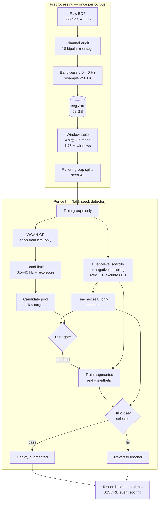
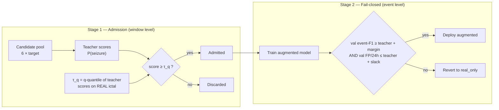

# Does synthetic ictal EEG augmentation help, harm, or neither?

A leakage-safe, pre-registered benchmark of generative augmentation and fail-closed trust
gating for **patient-independent** seizure detection on CHB-MIT, scored at the **event level**
with SzCORE conventions.

The short answer, at n = 9 paired runs per detector across three architecture families:
**synthetic ictal augmentation performs at parity with simple baselines; the trust gate's
admission rule contributes nothing over injecting the same number of random windows; but the
gate does reliably control the false-alarm tail.** Details and caveats in
[Results](#results).

> **Status.** Phase 1 complete. This repository contains the full experimental record,
> including a correction to our own headline analysis (see
> [Reference selection is not neutral](#reference-selection-is-not-neutral)). Phase 2 is
> specified but not run.

---

## Contents

- [Why this benchmark exists](#why-this-benchmark-exists)
- [Relationship to prior work](#relationship-to-prior-work)
- [Data and preprocessing](#data-and-preprocessing)
- [Experimental design](#experimental-design)
- [Pipeline architecture](#pipeline-architecture)
- [The trust gate](#the-trust-gate)
- [Results](#results)
- [Methodological findings](#methodological-findings)
- [Reproducing](#reproducing)
- [Repository layout](#repository-layout)
- [Limitations](#limitations)
- [Citation](#citation)

---

## Why this benchmark exists

Seizures are rare. In our processed CHB-MIT corpus, ictal windows are **0.319 %** of the data
(5,563 of 1,746,447). That imbalance makes generative augmentation of the positive class an
attractive idea, and a large literature reports gains from it.

Two things make most of those reports hard to act on clinically:

1. **Window-level metrics conceal event-level harm.** A model can improve balanced accuracy or
   AUROC while inflating false alarms per day — the number that determines whether a detector is
   deployable. We score every arm with `timescoring` under the SzCORE conventions
   (`toleranceStart = 30 s`, `toleranceEnd = 60 s`, `minOverlap = 0`, `maxEventDuration = 300 s`,
   `minDurationBetweenEvents = 90 s`) and report FP/24 h alongside event-F1 throughout.
2. **Patient-independent validation is rare.** Splitting windows rather than patients leaks
   subject identity and inflates every number. Here, patient groups are partitioned *before*
   windowing, generators are fit on training patients only, and provenance is enforced in code
   and tested.

The benchmark's primary object of study is therefore **harm**, pre-registered before test
scoring, with tail risk reported alongside every mean.

## Relationship to prior work

The fail-closed trust gate is **not our invention**. It is adapted from trust-gated augmentation
(TGA):

> Choi, D.; Yip, C.; Choi, A.; Park, J. (2026). *Trust-gated synthetic EEG augmentation reduces
> performance drops when generalizing to new patients.* **npj Digital Medicine 9(1), art. 634.**
> [`10.1038/s41746-026-02778-0`](https://doi.org/10.1038/s41746-026-02778-0) · PMID 42185473

Our contributions are the **seizure-specific, event-level reformulation** of the admission and
fail-closed criteria, the **harm characterisation** under a pre-registered definition, and the
**controls** that the source study left unresolved — notably the matched-volume random-gating
control, which the TGA authors ran and reported as mixed.

Implementation fidelity to the published method is documented honestly, including where this
benchmark diverges, in the verification record §2.1. The
divergences are material: our admission threshold is calibrated against real ictal windows rather
than the candidate pool, and our minimum-acceptance safeguard is 1 rather than TGA's K_min = 200.

## Data and preprocessing

[CHB-MIT Scalp EEG](https://physionet.org/content/chbmit/1.0.0/) (PhysioNet), retrieved from the
AWS Open Data mirror.

| property | value |
|---|---|
| patients / groups | 24 / **23** (chb21 is chb01 re-recorded and is grouped with it) |
| recordings | 686 EDF files, 676 in manifest, **673 retained** after channel audit |
| duration | 3,505,100 s = **973.6 h** |
| seizure events | **198** annotated; 185 survive windowing |
| montage | **18 bipolar channels**, common to all retained files |
| sampling rate | 256 Hz |
| band-pass | 0.5–40 Hz, zero-phase Butterworth (order 4) |
| windows | 4 s, 2 s stride → **1,746,447** windows, **5,563 ictal (0.319 %)** |
| normalisation | per-window, per-channel z-score |

Files whose montage cannot supply the 18-channel set are dropped by an explicit audit
(`chbmit/channel_audit.py`), which also reports the fraction of seizure events lost — 6.6 % here.
Peri-ictal background within 60 s of a seizure is excluded from training negatives to avoid
ambiguous labels.

## Experimental design

Pre-registered in [`PREREGISTRATION.md`](PREREGISTRATION.md), with machine-readable constants in
[`configs/chbmit_synthetic.yaml`](configs/chbmit_synthetic.yaml). **Harm** is fixed before test
scoring as a paired delta with `Δevent-F1 < −0.01` **OR** `ΔFP/24h > +0.25`, reported with harm
rate, worst-cell delta, and CVaR at α = 0.10.

**Grid.** 3 detectors × 3 folds × 3 seeds × 7 conditions = **189 runs** (n = 9 paired cells per
detector per condition).

**Detectors** — three families, deliberately spanning two orders of magnitude in capacity so that
a benefit seen in one can be attributed to capacity or to architecture:

| detector | family | parameters |
|---|---|---|
| EEGNet | compact depthwise-separable CNN | **1,905** |
| LCT | conv stem + transformer encoder | **120,834** |
| TCN | dilated causal convolutions | **129,441** |

**Conditions:**

| condition | role |
|---|---|
| `real_only` | baseline; also the gate's teacher |
| `class_weighted` | registered simple baseline (focal loss with positive weighting) |
| `classical_aug` | registered simple baseline (signal-space augmentation) |
| `ungated` | all synthetic injected, no gate |
| `gated q=0.90` | pre-registered core trust gate |
| `gated q=0.50` | admission sweep point |
| `random_gated q=0.90` | **matched-volume control** — same count, uniform random selection |

**Splits.** Patient groups partitioned before windowing; test groups are perfectly disjoint across
folds. Folds 0–2 were run (train/val/test groups: 14/5/4, 13/6/4, 14/4/5).

**Generator.** WGAN-GP fit per (fold, seed) on that fold's training ictal windows only, with
outputs band-limited to the acquisition passband before injection. Nine checkpoints are cached in
the repository, so the grid reproduces without retraining a generator.

## Pipeline architecture



Leakage controls, each enforced in code and covered by tests:

- patient groups are split **before** windowing, never after;
- generators are fit **only** on the training patients of their fold;
- validation and test always use full, unmodified real timelines;
- synthetic windows are training-only and carry per-window provenance;
- the operating threshold is selected on **validation** and applied unchanged to test.

## The trust gate

Two stages, both event-level reformulations of the published method.



**Admission is badly conditioned as built.** Because the threshold is a quantile of the teacher's
scores on *real* ictal windows, and the teacher saturates there, moving `q` from 0.50 to 0.90
shifts the threshold by 0.037 while changing admission **174×**. At q = 0.99 nothing is admitted
at all. The published method instead takes a rank cut on the candidate pool, which is
well-conditioned; `TrustGateConfig.reference = "pool"` implements that and is the Phase 2 default.

Observed admission across the 27 gated q = 0.90 cells: **median 80 windows** (range 0–580),
against a target of ~2,508. Revert rate **0.81**. At q = 0.50, 63 % revert and the median
admitted count is exactly **2,508** — the requested quota — meaning the threshold never binds and
that arm is really a top-1/6 rank cut, not a confidence threshold.

## Results

All figures are n = 9 paired (fold, seed) cells per detector, event-F1 on held-out patients.

### Arm means

| detector | `real_only` | `class_weighted` | `classical_aug` | `ungated` | `gated q0.90` | `random_gated` |
|---|---|---|---|---|---|---|
| EEGNet | 0.225 | 0.205 | 0.197 | 0.234 | 0.218 | 0.224 |
| LCT | 0.312 | 0.299 | 0.298 | 0.317 | 0.318 | 0.327 |
| TCN | 0.293 | **0.364** | 0.225 | 0.268 | 0.301 | 0.305 |

### Q1 — Does synthetic augmentation beat simple baselines?

**No, and it does not lose either — it is at parity.** Δevent-F1 for `gated q0.90` against each
baseline (cells better, of 9):

| detector | vs `real_only` | vs `class_weighted` | vs `classical_aug` |
|---|---|---|---|
| EEGNet | −0.007 (1/9) | +0.013 (5/9) | +0.021 (6/9) |
| LCT | +0.006 (1/9) | +0.019 (4/9) | +0.020 (5/9) |
| TCN | +0.008 (1/9) | **−0.063 (2/9)** | +0.076 (6/9) |

The single genuine loss is **TCN against `class_weighted`**, where a one-line loss reweighting
reaches 0.364 event-F1 at 9.8 FP/24 h versus `real_only`'s 0.293 at 16.9 — better on both axes.
For a rare-event problem this is the expected place for reweighting to win, and it does.

### Q2 — Does admission quality matter?

**No.** At matched injection volume — `random_gated` draws exactly as many windows as
`gated q0.90` from the same pool, verified equal per cell — teacher-confidence selection is
indistinguishable from a uniform random draw:

| detector | `gated q0.90` | `random_gated q0.90` | difference |
|---|---|---|---|
| EEGNet | 0.218 | 0.224 | 0.006 |
| LCT | 0.318 | 0.327 | 0.009 |
| TCN | 0.301 | 0.305 | 0.004 |

All three gaps are an order of magnitude below between-cell spread. Whatever the gate is doing,
it is not selecting better windows. This is the control the source study reported as mixed; here
it resolves against admission quality.

### Q3 — Capacity or architecture?

**Neither: there is no heterogeneity left to explain.** All three families behave alike. An
earlier iteration of this benchmark reported "TCN benefits, EEGNet is neutral"; that contrast does
not survive the addition of the registered baselines and the third detector family.

### Q4 — What does the gate actually control?

**The false-alarm tail, decisively.** Pooling all 81 gated-family cells and splitting by the
gate's own admit/revert decision (Δ against `real_only`, augmented model):

| | n | mean ΔFP/24h | median | worst | mean Δevent-F1 |
|---|---|---|---|---|---|
| **admitted** | 21 | **−22.58** | −26.34 | **+15.28** | +0.031 |
| **reverted** | 60 | **+10.90** | +13.83 | **+62.63** | −0.025 |

- ΔFP/24 h separation: Mann–Whitney **p < 0.0001**; within-fold permutation (20,000 draws)
  **p < 0.0001**, both two-sided
- Tail event ΔFP/24 h > +20: **0 of 21 admitted vs 23 of 60 reverted**, Fisher exact
  **p = 0.0004**
- Δevent-F1 separation: **p = 0.092** — weak

The asymmetry is the finding. **The gate is a false-alarm tail controller, not an event-F1
selector**, and this is the only result in the grid that survives correction for the 48
comparisons reported.

### Statistics

We report the Wilcoxon signed-rank test that is conventional in this literature **and** the
corrections it requires, because the nine cells per detector are not independent — three seeds
share each split.

| correction | effect |
|---|---|
| Nadeau–Bengio (variance scaled by `1/n + n_test/n_train`, ratio 0.317) | **no comparison reaches p < 0.05**; minimum p = 0.054 where Wilcoxon reports 0.016 |
| fold-level t-test (seeds averaged, disjoint test groups) | consistent with the above |
| Bonferroni over the 48 reported comparisons | threshold p < 0.0010; **only the tail result clears it** |

Defensible claims from this grid are therefore **direction and count**, not significance — with
the single exception of the tail-control result.

## Methodological findings

Three results about *measurement* emerged that are independent of the augmentation question, and
in our view are the most transferable part of this work.

### Reference selection is not neutral

The pre-registration names the harm reference as "the best simple baseline per (fold, seed)".
That is a **selected maximum**, and our first analysis compounded the problem by selecting it on
*test* performance. The result is an inflated reference:

| detector | real_only | class_weighted | classical_aug | **best-of-3** |
|---|---|---|---|---|
| EEGNet | 0.225 | 0.205 | 0.197 | **0.298** |
| LCT | 0.312 | 0.299 | 0.298 | **0.413** |
| TCN | 0.293 | 0.364 | 0.225 | **0.428** |

For EEGNet and LCT the best-of-3 reference exceeds **every individual baseline by 0.07–0.10** —
no baseline is that good; the gap is the maximum of three noisy estimates. Against that reference
the same gated arm reads −0.080 to −0.128 with 0 of 9 cells better, which is how we first
reported it. Against any single pre-specified baseline it is at parity.

**Baseline choice moved the apparent effect by ±0.13 event-F1, against a true effect of
0.01–0.06.** The correction is recorded in full at the end of
[`reports/DECISION_GATE_1.md`](reports/DECISION_GATE_1.md) rather than silently applied; the
original claim and its refutation both stand in the record.

### Results are sensitive to execution environment, not only to seed

Two measured instances:

- **DataLoader workers change results.** Raising `--num-workers` from 0 to 8 is 2.16× faster and
  changes **6 of 7 conditions** on an otherwise byte-identical cell (`real_only` 0.0938 → 0.1605;
  `gate_n_admitted` 198 → 436). PyTorch draws a base seed from the global RNG to seed workers,
  perturbing the stream that also drives dropout and the shuffle permutation. All results here use
  `num_workers = 0`.
- **Hardware and library versions change results.** The same cell scored 0.310 on one GPU and
  0.245 on another, with byte-identical splits and matching training-table sizes. No
  deterministic-algorithm flags are set.

Consequently, **all comparisons in this repository are within-run**, and cross-run per-cell
comparison is explicitly unsupported.

### A fail-closed gate must fall back to the best available model

`_apply_fail_closed` reverts to the `real_only` teacher, while the pre-registration defines harm
against the best simple baseline. Where a baseline beats `real_only`, every revert discards that
gap — the gate fails *open* with respect to its own registered criterion. Re-scoring the
**same admission decisions** with a best-baseline fallback (no retraining; reverting is a
deterministic choice among already-computed arms):

| detector | as built | best-baseline fallback | harm rate |
|---|---|---|---|
| EEGNet | −0.080 | **−0.016** | 0.44 → **0.11** |
| LCT | −0.095 | **−0.037** | 0.67 → **0.22** |
| TCN | −0.128 | **−0.007** | 0.78 → **0.11** |

*(Deltas against the best-of-3 reference; see the caveat above. The relative improvement is the
point.)*

### The generator is not the explanation

Before accepting a null we audited what was being injected. Against the fold-0 checkpoint:

| check | result | verdict |
|---|---|---|
| mode collapse (mean pairwise distance ÷ real) | **0.911** | diverse; a cVAE variant scored 0.001 |
| memorisation (synth→real NN ÷ real→real NN) | **1.156** | not copying training data |
| normalised space | mean 0.0000, std 1.0000 | correct |
| out-of-band power > 40 Hz | 0.0093 → **0.0005** after band-limiting | as designed |
| in-band spectrum (δ→γ, ratio to real) | 0.76 – 1.32 | reasonable |
| cross-channel mean \|corr\| | 0.205 vs real 0.263 | **under-coupled** |
| amplitude extremes | \|max\| 7.6 vs real 15.5 | **tails missing** |

The last two are genuine fidelity limitations and are reported as such. They are not defects, and
the synthetic data is diverse, novel and correctly scaled — so the parity result is a statement
about augmentation, not about a broken generator. Reproduce with
`python3 scripts/diag_generator_health.py 0 42`.

## Reproducing

### Requirements

```bash
pip install -r requirements.txt
```

Core: `numpy<2.0`, `scipy`, `pandas`, `zarr<3.0`, `torch>=2.1`, `scikit-learn`, `mne`, `pyedflib`,
`timescoring`.

### 1. Build the dataset

```bash
aws s3 sync --no-sign-request s3://physionet-open/chbmit/1.0.0/ data/raw_chbmit/
python3 scripts/run_preprocess.py
```

~43 GB download, ~54 min single-threaded preprocessing, producing a 52 GB Zarr store.
Splitting is seeded at 42; verify determinism before trusting cached generator checkpoints:

```bash
git diff --stat -- results_chbmit_synthetic/real_validation/splits/splits_seed42.json   # must be empty
```

### 2. Run the grid

```bash
python3 scripts/run_multiseed_downstream.py \
  --folds 0 1 2 --seeds 42 123 2024 --detectors eegnet lct tcn \
  --qs 0.90 0.50 --tag _v2
```

Resumable — completed `(fold, seed, detector)` blocks are skipped via the output CSV. The nine
WGAN checkpoints are cached in the repository, so no generator training occurs. **Do not raise
`--num-workers`**; see [above](#results-are-sensitive-to-execution-environment-not-only-to-seed).

Reference runtime: 13.1 h wall-clock on three NVIDIA A100 workers, one per detector
(≈ 1.2–1.9 h per block). The workload is dominated by single-threaded per-window normalisation on
the CPU, not by GPU compute, so a smaller accelerator performs comparably.

### 3. Analyse

```bash
python3 scripts/analyze_multiseed.py --tag _v2
```

Emits the paired-delta summary, the safety–benefit frontier and the admitted-vs-reverted tail
analysis, with Nadeau–Bengio and fold-level tests alongside Wilcoxon and an explicit comparison
count. Legacy 4-condition CSVs are readable with `--conds-expected 4`.

### Cloud execution

`scripts/vertex_*.sh` run the grid as one Vertex AI custom job per detector on Spot instances,
staging code and data from GCS and syncing partial results back so preemption costs at most one
block.

## Repository layout

```
chbmit/          corpus handling — manifest, channel audit, preprocessing, windowing,
                 patient-group splits, scarcity subsampling, dataset/normalisation
models/          detectors — EEGNet, LCT, TCN (registry in __init__.py)
synthetic/       generators (cVAE, WGAN-GP), band-limiting, trust gate, quality checks
augmentation/    non-generative baselines — class weighting, classical augmentation,
                 balanced sampling
evaluation/      SzCORE event scoring, window metrics incl. Brier/ECE, threshold selection,
                 patient-level aggregation, paired statistics and tail risk
experiments/     cell runner and training loop, grid drivers, aggregation
scripts/         entry points — preprocessing, the multi-seed grid, analysis, diagnostics
reports/         the verification record (verified findings), DECISION_GATE_1.md (Phase 1 results
                 and correction), the implementation plan (what remains)
tests/           leakage, scoring, split and gate invariants
```

Key documents:

| file | contents |
|---|---|
| [`PREREGISTRATION.md`](PREREGISTRATION.md) | analysis decisions fixed before test scoring |
| the verification record | every verified number, with reproduction snippets |
| [`reports/DECISION_GATE_1.md`](reports/DECISION_GATE_1.md) | Phase 1 results **and the correction to them** |
| the execution log | execution log, environment notes, known hazards |

## Limitations

Stated plainly, because several of them bound the conclusions:

1. **Single dataset.** CHB-MIT only. It is pediatric and 2.2× denser in seizures than the
   Dianalund corpus used by the SzCORE challenge, which raises FP/24 h at fixed precision. Siena
   is specified but not run.
2. **Underpowered.** n = 9 per detector, from 3 folds × 3 seeds. No comparison except the
   tail-control result survives correction for fold dependence or multiplicity.
3. **Three folds of five.** The registered design is 5 folds; folds 3–4 were not run.
4. **Validation panel is narrow.** Only 8 of 23 patient groups ever serve as validation, and five
   of them appear in 4 of 5 folds. Both the admission threshold and the fail-closed decision live
   entirely on validation, so the gate has effectively been evaluated on one near-fixed panel.
5. **Scarcity fixed at 1.0.** The registered grid includes 0.5 and 0.25, where augmentation has
   most to offer. Not run.
6. **Admission reference diverges from the published method** (real-ictal quantile rather than a
   pool rank cut), which makes `q` a poorly-conditioned control and `q = 0.99` unreachable.
7. **Generators are unconditional.** The cVAE's class embedding is constant and
   `wgan_gp_provider.generate()` accepts a `class_label` it never uses. Only the ictal phase is
   generated, which is the convention in this literature but forecloses the label-consistency half
   of the published admission rule.
8. **Pre-registration deviations** are declared in the verification record §5.

## Citation

If you use this benchmark, please cite the source method as well:

```bibtex
@article{choi2026tga,
  title   = {Trust-gated synthetic {EEG} augmentation reduces performance drops
             when generalizing to new patients},
  author  = {Choi, D. and Yip, C. and Choi, A. and Park, J.},
  journal = {npj Digital Medicine},
  volume  = {9},
  number  = {1},
  pages   = {634},
  year    = {2026},
  doi     = {10.1038/s41746-026-02778-0}
}
```

CHB-MIT is distributed by PhysioNet under the Open Data Commons Attribution License; see the
[dataset page](https://physionet.org/content/chbmit/1.0.0/) for its citation requirements.

## License

**No license file is present yet.** Without one, default copyright applies and others cannot
legally reuse this code — add a `LICENSE` before publication. MIT or BSD-3-Clause are the
conventions for benchmarks of this kind.

CHB-MIT data is not redistributed in this repository; obtain it from PhysioNet under its own
terms.
